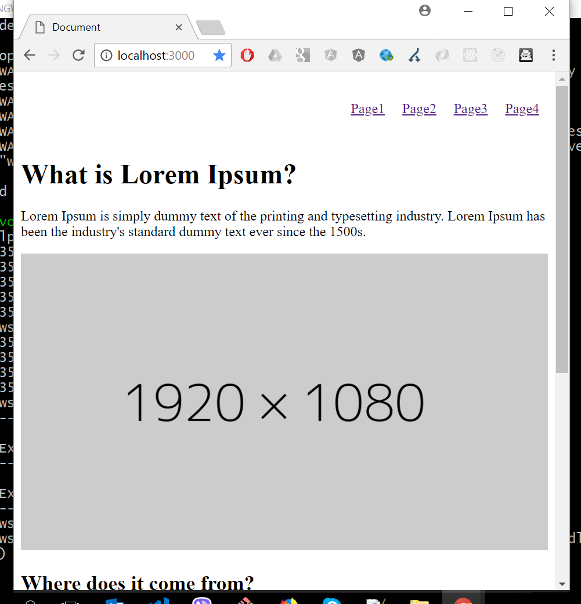
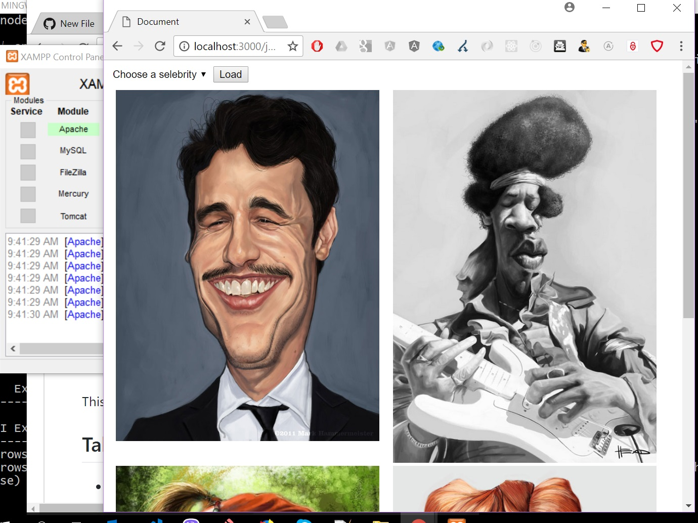
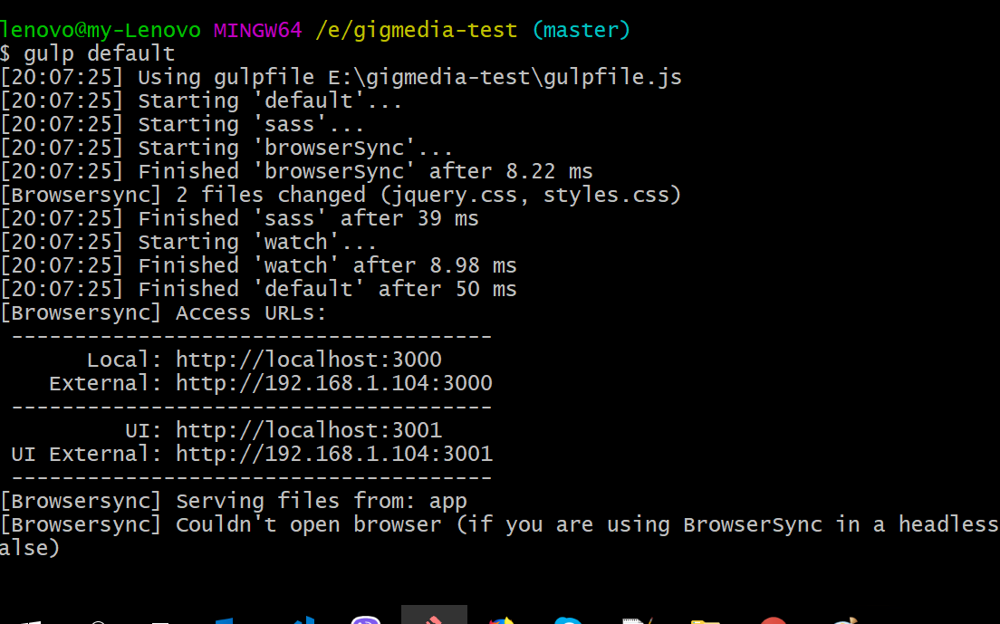
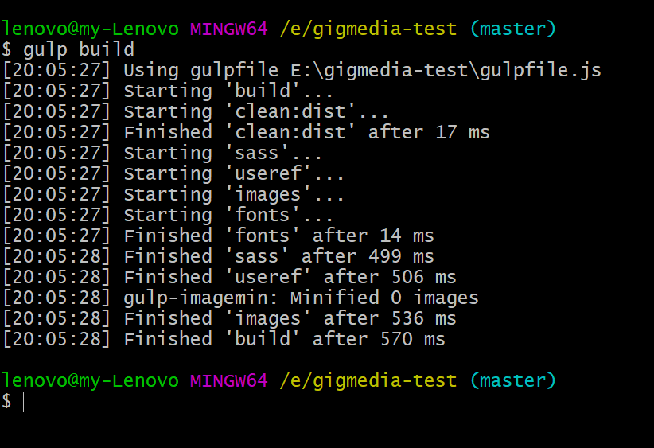

This project was created without any boilerplate. I use pure javascript and jquery for the code,
gulp for merging css & js files, converting scss -> css, auto reload the page on js changes etc.


## Table of Contents
- [About](#about)
- [Workflow](#workflow)
- [Folder Structure](#folder-structure)
- [Run local](#run-local)
- [Available Scripts](#available-scripts)
  - [gulp default](#gulp-default)
  - [run php](#run-php)
  - [gulp build](#gulp-build)
- [Presentation video](#presentation-video)


## About
* It is a javascript application consisted of two separated pages: index.html & jquery.html. On index.html
i use style mainly, to make it responsive both on large and small screens with the help of 'flexbox'.
On jquery, again there is some style but the main functionality is the ajax call to the server for getting
image data to the client.

- Functionalities 'index.html':
  - just a page with blocks that they behave responsive when the browser changes width.
  

- Functionalities 'jquey.html':
  - The page loads empty
  - When the user clicks on 'load' button:
    - an ajax request is made to the php server in order to fetch json data (image names)
  - The user can select an image by selecting a name on the drop box
  - The user can select an image by clicking on the image
  - The image data are saved on localStorage, the first time that they are fetched, so that not executing the ajax request each time the user  clicks the 'load' button.

  

* It is written in javascript + jquery and some other dependencies:
- gulp
- sass

## Folder structure

I have run `npm run eject`, in order to have better control over, 
webpack, eslint etc.

The structure of the project is this:
```
app/
  css/
    <!-- generated css files from scss files ->
  images/
    <!-- the images for the blocks -->
  js/
    lib.js <!-- all the functionalities are here (ajax, onClick, onChange etc) -->
  scss/
    jquery.scss
    styles.scss
  index.html
  jquery.html
  dist/
    <!-- generated files when $ gulp build script executed -->
  node_modules/
    <!-- gulp dependencies mainly -->
  readme_images/
gulpfile.js
package.json
README.md
```

## Run local

In order to run localhost you shoul:

* download/clone the repo to a folder
* execute $ npm install, to install all the dependencies and create 'node_modules' folder
* $ gulp default, to start the development server
* open your browser on http://localhost:3000/

## Available Scripts

In the project directory, you can run:

### `gulp default`

`$ gulp default` runs the app in the development mode.<br>
Open [http://localhost:3000](http://localhost:3000) to view it in the browser.

The page will reload if you make edits.<br>


### `run php`
The application makes a request to a php file in order to get the json data.
In order to do that, both ajax.php & data.json , should be served on a php server, e.g. apache.

### `gulp build`

`$ gulp build`, deletes the `dist` folder and creates it again from the start, with minified `js` and `css` files, font files etc.




## `Presentation video`

* a small presentation of the final outcome is here: https://www.youtube.com/watch?v=sFup0veJQcA
